# SpringCar

### Project Description

SpringCar in a prototype of an Android Application for a car renting company.
It connects to an external REST server (Herokuapp) using Retrofit.

The application is divided in three main blocks:
- **User Area**
  - **User Registration** _Only shown the first time the user installs and opens the app_
  - **View User Profile** _Read only data_
  - **Edit User Profile** _Same as Registration form but showing stored user data_
- **User Reservations**
  - **My Reservations List** _List view of confirmed user reservations ordered by date_
  - **Reservation Detail** _See selected reservation detail. It is possible to cancel it._
- **New Reservation**
  - **Location Selection** _Map showing the SpringCar offices locations. User can select office using the map markers or the spinner below_
  - **Dates Selection** _Calendar widget where user can select the start and the end of the reservation. The minimum is one day_
  - **Car Selection** _List of available cars for the user to select_
  - **Extras Selection** _List of insurances and extras that the user can add to the reservation_
  - **Confirmation** _Reservation view for the user to confirm that all the data is correct._
  - **Success** _Reservation view with reservation number on top_

Every one of these blocks is composed the following way:
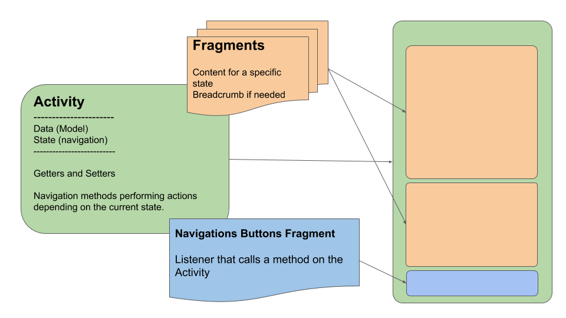

### Model Class Diagram

  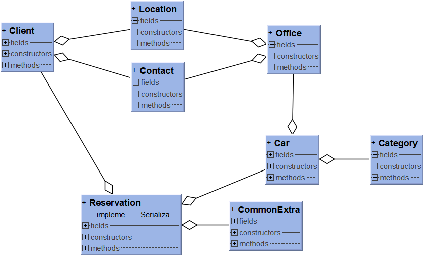 

### Technologies
* [Retrofit](https://square.github.io/retrofit/) - A type-safe HTTP client for Android and Java
* [GSon](https://github.com/google/gson) - A Java serialization/deserialization library to convert Java Objects into JSON and back
* [Picasso](https://square.github.io/picasso/) - A powerful image downloading and caching library for Android
* [Google Maps SDK](https://developers.google.com/maps/documentation/android-sdk/intro) - Add maps based on Google Maps data

### Project Goals
- [x] To have a complete reservation flow
- [x] To be able to show a list of all reservations by client
- [x] Show user profile and allow the user to update the data
- [x] Show loader on API calls
- [x] clone and repeat call on server timeout to fix failure when herokuapp server is sleeping 
- [ ] Validate user data in Registration form with regex
- [ ] User login using Token (JWT)
- [ ] On the user reservations list, differenciate between the already consumed and the ones to come

### Application look&feel

Main menu

  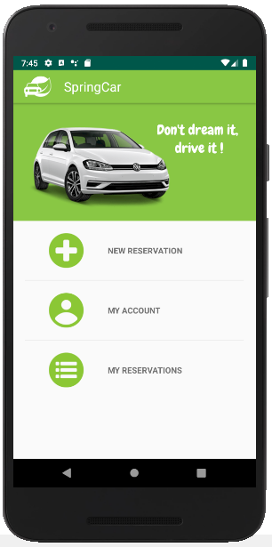 

New reservation

  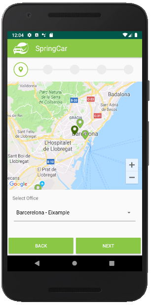 
  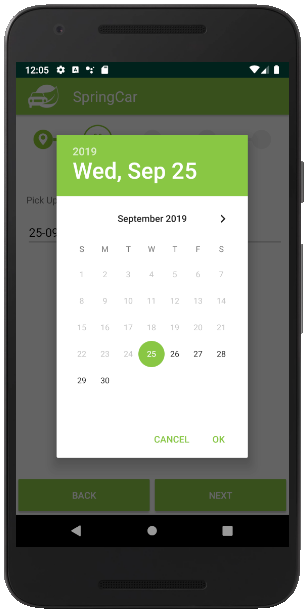 
  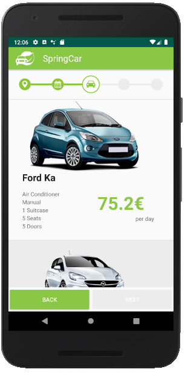 
  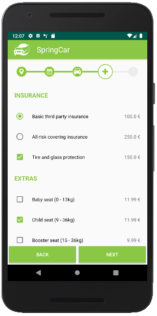
  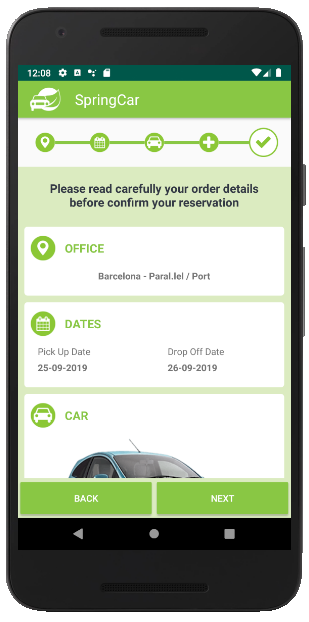 

User Reservations

  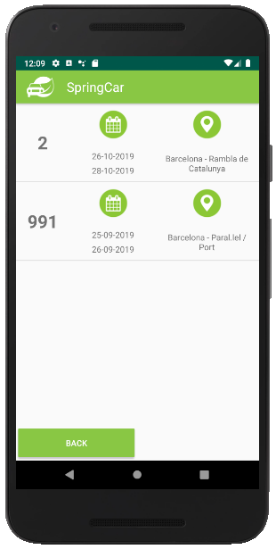
  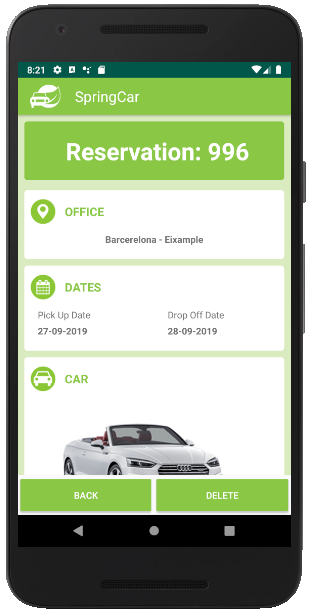
  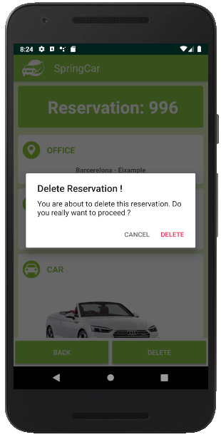

User Profile

  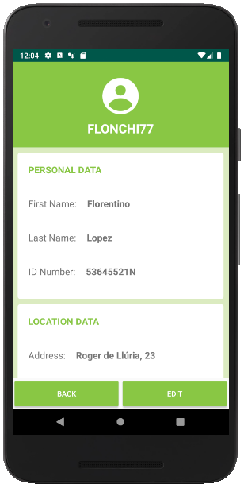
  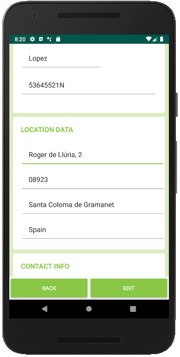

