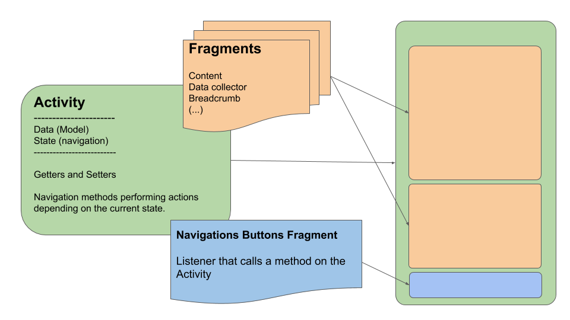

# SpringCar

### Project Description

SpringCar in a prototype of an Android Application for a car renting company.
It connects to an external REST server (Herokuapp) using Retrofit.

The application is divided in three main blocks:
- **User Area** _where the user can see his personal data, and edit it if necessary_
- **User Reservations** _where the user can see the list of reservations he has confirmed_
- **New Reservation** _where the user can place a new reservation_

Every one of these blocks is composed the following way:

### Model Class Diagram

### Technologies
* [Retrofit](https://square.github.io/retrofit/) - A type-safe HTTP client for Android and Java
* [GSon](https://github.com/google/gson) - A Java serialization/deserialization library to convert Java Objects into JSON and back
* [Picasso](https://square.github.io/picasso/) - A powerful image downloading and caching library for Android
* [Google Maps SDK](https://developers.google.com/maps/documentation/android-sdk/intro) - Add maps based on Google Maps data

### Project Goals
- [x] To have a complete reservation flow
- [x] To be able to show a list of all reservations by client
- [x] Show user profile and allow the user to update the data
- [ ] Validate user data in Registration form with regex
- [ ] User login using Token (JWT)
- [ ] On the user reservations list, differenciate between the already consumed and the ones to come

### Application look&feel

Main menu

   

New reservation

   
   
   
  
   

User Reservations

   

User Profile

   

